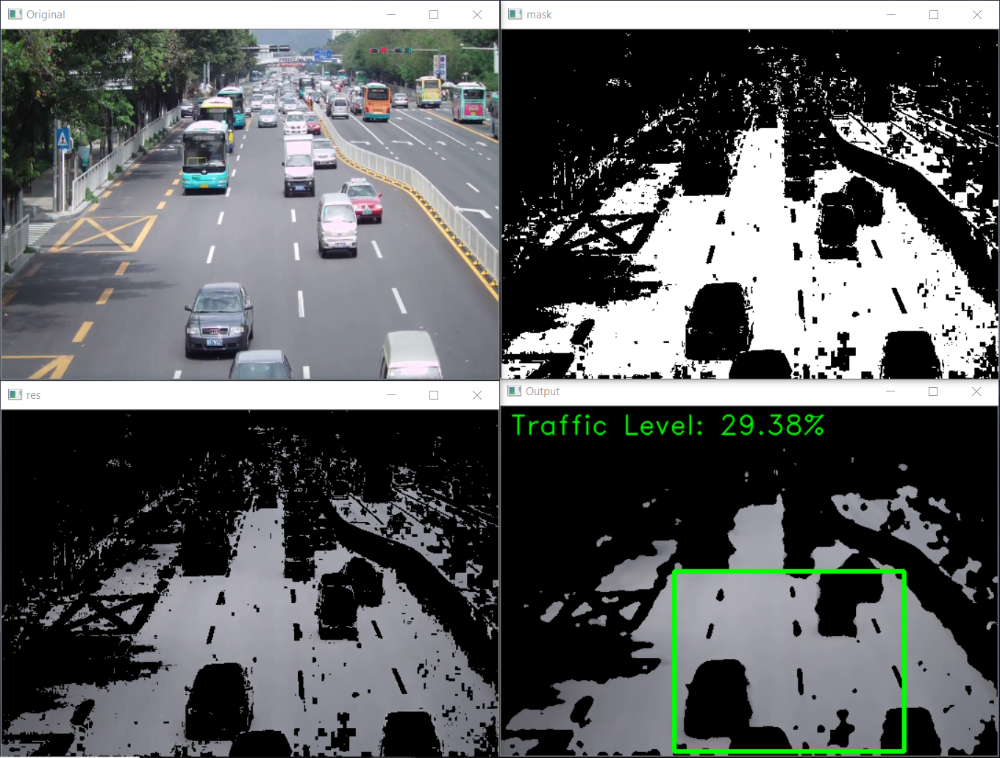

# Traffic Detection

### OpenCV | Python
  - Using OpenCV library, amount of color of road has been calculated and based on that, traffic percentage is displayed of selected green area.
  - For execution, run main2.py

### Screenshots

